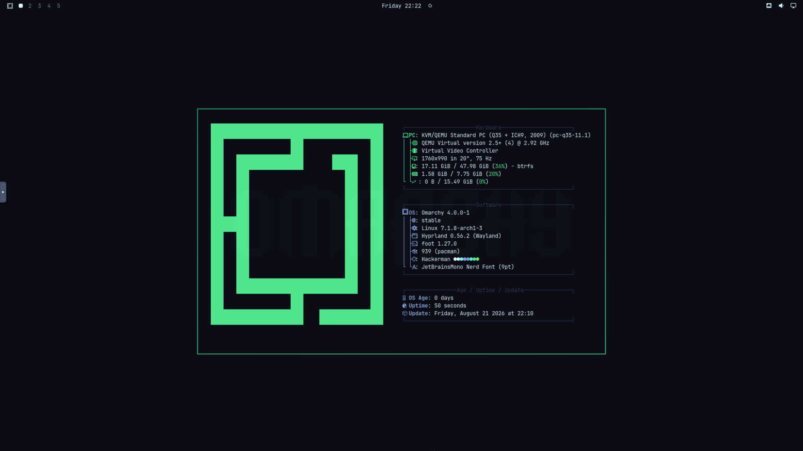

<p align="center">
    
</p>

# domarchy (Dockerized Omarchy)

Beautiful, Modern & Opinionated Dockerized Linux. This repo exists primarily as a personal sandbox for testing and developing Omarchy configuration scripts in a fully isolated environment. It also aims to make Omarchy accessible to anyone who wants to try it without committing to a full installation or dual boot setup.

## Getting Started

```bash
docker compose up -d --build
```

Connect to the VM display: [http://localhost:8900](http://localhost:8900)

**N.B.** On the first run you will be greeted by the Omarchy installer. Complete the installation manually before using the system. Subsequent starts will boot directly into Omarchy.

## Keyboard Shortcuts

When running domarchy inside Omarchy, keyboard shortcuts will be intercepted by the host. To forward all shortcuts to the container, add the following to your host's Hyprland config:

```bash
nvim ~/.config/hypr/hyprland.conf
```

Add at the bottom:

```
bind = SUPER, F10, submap, passthrough
submap = passthrough
bind = SUPER, F10, submap, reset
submap = reset
```

Then reload Hyprland:

```bash
omarchy-restart-hyprctl
```

Now press `Super + F10` to toggle keyboard passthrough to the container.

## Sharing Files

The `shared/` folder in the project root is automatically mounted inside the container and exposed via Samba. You can access it from within the Omarchy guest without credentials.

To connect from within the VM, mount the share:

```
smb://10.0.2.4/qemu
```

**N.B.** `10.0.2.4` is hardcoded by QEMU for the Samba share and will never change regardless of the container's IP.
